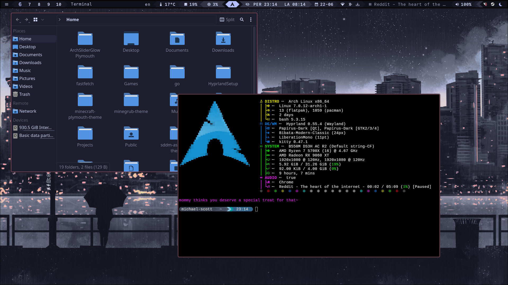

# Hyprland Setup



My personal Hyprland dotfiles and configuration for Arch Linux.

## Installation

Copy the `.config`, `.local`, and other dotfolders into your home directory:

```bash
cp -r .config ~/
cp -r .local ~/
```

## Wallpaper

Comes with a default wallpaper managed by `swaybg`. The script at `~/.local/share/scripts/multimonwallpapers.sh` controls wallpaper placement across multiple monitors.

- Edit the script to change wallpaper paths.
- Reload wallpapers with **Meta + W**.

## Configuration

- Edit `.config/hypr/hyprland.conf` to match your monitor names.
- Edit `.config/waybar/modules/hyprland/workspaces.jsonc` and change the monitor names under `"persistent-workspaces"` for persistent workspace icons on the correct displays.
- Remove autostart entries for programs you don't use.
- Edit the lock screen background in `.config/hypr/hyprlock.conf`.

## Dependencies

```
hyprland hypridle hyprpicker waybar rofi bluetui nmtui hyprshot hyprlock grim slurp
wiremix hyprshutdown swaybg swaync bluez-utils brightnessctl
fzf networkmanager pacman-contrib otf-commit-mono-nerd uwsm cliphist
wl-clipboard qt5ct qt6ct-kde dolphin konsole kitty breeze breeze5 nwg-look gnome-keyring polkit polkit-kde-agent
```

## Display Manager

Works best with **SDDM** login manager.

## Audio

If audio icons don't appear in waybar, install `pipewire`, `pipewire-pulse`, and `wireplumber`, then run:

```bash
systemctl --user restart pipewire pipewire-pulse wireplumber
```

## Notes

- Only tested on **Arch Linux**, btw.
- Works well in `uwsm` managed session.
- `XF86AudioRaiseVolume` / `XF86AudioLowerVolume` keybinds only work if you have a **Corsair K70 RGB Core** keyboard with **OpenLinkHub** installed. (ID 1b1c:1bfd Corsair CORSAIR K70 CORE RGB Mechanical Gaming Keyboard)

## Keybindings

| Key | Action |
|-----|--------|
| Super + Q | Launch terminal (kitty) |
| Super + C | Kill active window |
| Super + M | Shutdown (hyprshutdown) |
| Super + E | Open file manager (dolphin) |
| Super + V | Clipboard history |
| Super + R | Launch app menu (rofi) |
| Super + F | Toggle fullscreen |
| Super + B | Open browser |
| Super + W | Reload wallpapers |
| Super + P | Pick color (hyprpicker) |
| Super + X | Toggle floating |
| Super + L | Lock screen (hyprlock) |
| Super + 1-0 | Switch to workspace |
| Super + Shift + 1-0 | Move window to workspace |
| Super + Arrows | Move window in tiling layout |
| Print | Screenshot region |
| Shift + Print | Screenshot output |
| Super + Print | Screenshot window |
| XF86AudioRaiseVolume | Raise volume |
| XF86AudioLowerVolume | Lower volume |
