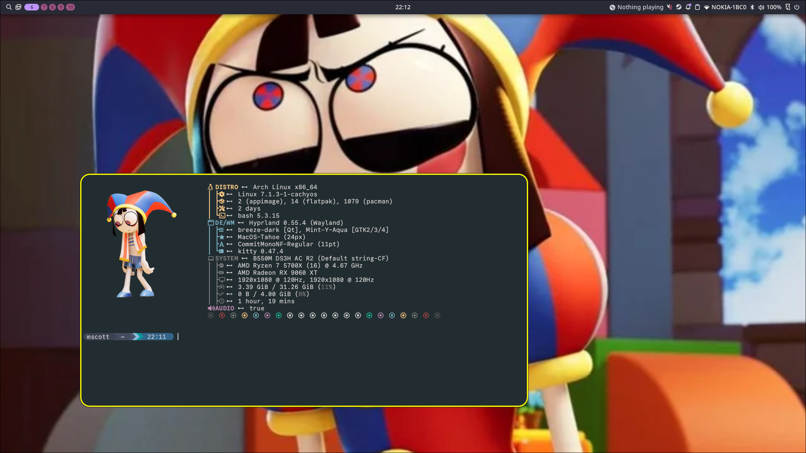

# Hyprland Setup



My personal Hyprland dotfiles and configuration for Arch Linux. Migrated to LUA programming language

## Installation

Copy the `.config`, `.local`, and other dotfolders into your home directory:

```bash
cp -r .config ~/
cp -r .local ~/

either move the lua or the hyprlang configs out of their respective folders and put them directly into ~/.config/hypr/
```

## Wallpaper
Noctalia has a built in wallpaper plugin
that's what I used lol

## Configuration

- Edit `.config/hypr/hyprland.lua` to match your monitor names.
- Remove autostart entries for programs you don't use.

## Dependencies for ARCH with CachyOS Repos/CachyOS

```
sudo pacman -S hyprland hyprpicker hyprshot grim slurp hyprshutdown bluez bluez-utils uwsm cliphist rofi pipewire pipewire-pulse wireplumber wl-clipboard qt5ct qt6ct kitty breeze breeze5 nwg-look gnome-keyring polkit kvantum noctalia hypremoji xdg-desktop-portal xdg-desktop-portal-hyprland xdg-desktop-portal-gtk nemo xdg-user-dirs xdg-user-dirs-gtk
```
## Fedora COPR ##

```
sudo dnf copr enable lionheartp/Hyprland
``` 

## Fedora Dependencies
```
sudo dnf install plasma-breeze breeze-gtk breeze-icon-theme qt5ct qt6ct kvantum kvantum-qt5 pipewire pipewire-pulseaudio wireplumber bluez bluez-tools hyprland noctalia-git uwsm hyprshutdown hyprpicker hyprland-guiutils kitty hyprshot grim slurp nwg-look xdg-desktop-portal-hyprland cliphist wl-clipboard nemo xdg-user-dirs xdg-usr-dirs-gtk xdg-desktop-portal-gtk xdg-desktop-portal

## Display Manager

Works best with **SDDM** login manager.

## Audio

If audio icons don't appear in waybar, install `pipewire`, `pipewire-pulse`, and `wireplumber`, then run:

```bash
systemctl --user restart pipewire pipewire-pulse wireplumber
```

## Notes

- Only tested on **Arch Linux**, btw.
- Works well in `uwsm` managed session.
- `XF86AudioRaiseVolume` / `XF86AudioLowerVolume` keybinds only work if you have a **Corsair K70 RGB Core** keyboard with **OpenLinkHub** installed. (ID 1b1c:1bfd Corsair CORSAIR K70 CORE RGB Mechanical Gaming Keyboard)

## Keybindings

| Key | Action |
|-----|--------|
| Super + Q | Launch terminal (kitty) |
| Super + C | Kill active window |
| Super + M | Shutdown (hyprshutdown) |
| Super + E | Open file manager (nemo) |
| Super + V | Clipboard history |
| Super + R | Launch app menu (noctalia) |
| Super + F | Toggle fullscreen |
| Super + B | Open browser |
| Super + W | Reload wallpapers |
| Super + P | Pick color (hyprpicker) |
| Super + X | Toggle floating |
| Super + L | Lock screen (hyprlock) |
| Super + 1-0 | Switch to workspace |
| Super + Shift + 1-0 | Move window to workspace |
| Super + Arrows | Move window in tiling layout |
| Print | Screenshot region |
| Shift + Print | Screenshot output |
| Super + Print | Screenshot window |
| XF86AudioRaiseVolume | Raise volume |
| XF86AudioLowerVolume | Lower volume |


##PS

If anyone could figure out how to transfer this to NixOs, much appreciated!
