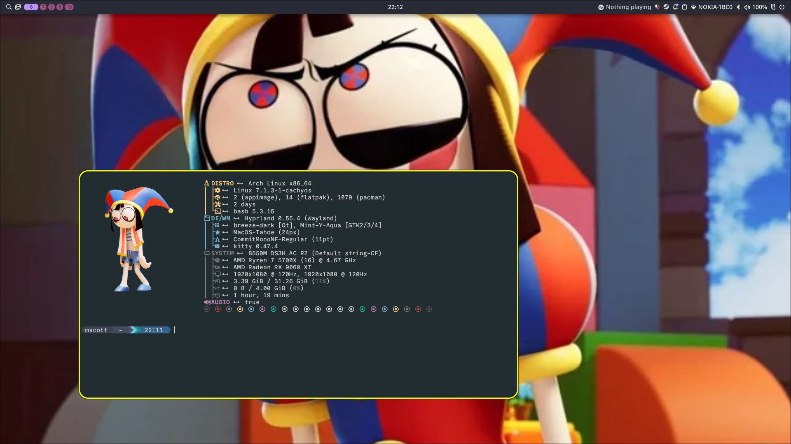

# Hyprland Setup



My personal Hyprland dotfiles and configuration for Arch Linux. Migrated to LUA programming language
## Installation Script
```
##Packages 
sudo chmod +x install.sh && ./install.sh

## Manual Install

```
rsync -a -v .local/ ~/.local/
rsync -a -v .config/ ~/.config/
sudo rsync -a -v usr/ /usr/
sudo rsync -a -v etc/ /etc/

sudo chown root:root /etc 
sudo chown root:root /usr
```
## Wallpaper
Noctalia has a built in wallpaper plugin
that's what I used lol

## Configuration

- Edit ~/.config/hypr/workspaces.lua and ~/.config/hypr/monitors.lua to match your monitor names.
- Remove autostart entries for programs you don't use in ~/,config/hypr/autostart.lua

## Animated Wallpapers
Video wallpapers set by Noctalia require mpvpaper 

## Display Manager

Works best with **SDDM** login manager.
Included is the SDDM Silent Gruvbox Theme

## Audio

If audio icons don't appear in waybar, install `pipewire`, `pipewire-pulse`, and `wireplumber`, then run:

```bash
systemctl --user restart pipewire pipewire-pulse wireplumber
```

## Notes

- Tested on Arch Linux btw.
- Works well in `uwsm` managed session.

To set kitty as default terminal in nemo when opening directorys in terminal, go to thunar, click edit>configure custom actions>double click on Open Terminal Here> put in kitty %f as the command
Like wise you can set thunar  as default file manager as well
```
xdg-mime default thunar.desktop inode/directory application/x-gnome-saved-search
```

##PS

If anyone could figure out how to transfer this to NixOs, much appreciated!

My Hyprland dotfiles have now been split for more ease of use 

This is arch only now

non-arch users can figure out instructions for their own distros


